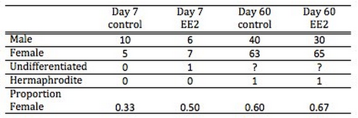
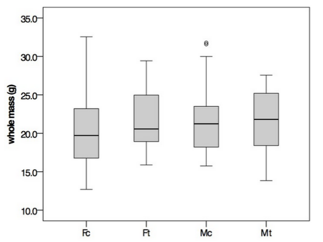
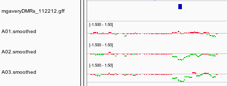

# Influence of 17α-ethinylestradiol on DNA Methylation in Oysters

**Mackenzie R. Gavery and Steven B. Roberts**

[Contact authors](https://github.com/sr320/paper-Oyster-EE2/issues/new)

---

## Background
Endocrine disrupting compounds (EDCs) are emerging environmental contaminants that threaten water quality and health of humans and wildlife worldwide. These compounds, many with structural similarities to hormones such as estrogen, affect endocrine pathways and can cause reproductive perturbations. These compounds enter aquatic ecosystems through a variety of sources including wastewater treatments facilities, septic systems, and industrial effluents.  While physiological effects of endocrine disruption have been described, it is becoming evident that our understanding of the biological pathways affected are incomplete and that alternative modes of action need to be explored.  One compound of concern is 17α-ethinylestradiol (EE2), the active constituent of the female contraceptive pill, that has been reported at high concentrations in aquatic environments.  Data collected in 1999 – 2000, from US streams in 30 states, reported concentrations of EE2 between 5 and 273 ng/L (Kolpin et al. 2002).  Effects of EE2 exposure include delayed sexual development, induction of vitellogenesis and feminization of males in both fish and bivalves (Schultz et al. 2003; Andrew et al. 2010).  Mechanisms underlying the response of bivalves is unclear.

Until recently, there has been limited research regarding the impacts of EDCs in aquatic invertebrate species such as molluscs.  This is in part due to the fact that less is known about the endocrine system in these organisms.  For example, evidence for a functional estrogen receptor, the canonical target of EDCs, has only been recently identified in bivalve molluscs (Matsumoto et al. 2007).  The bivalve ER appears to be a constitutive transcription factor and does not bind estrogen.  Nevertheless, a number of studies have recently described reproductive and developmental disruption in molluscs exposed to EDCs. Larval *C.gigas* exposed to the estrogen mimic nonylphenol at days 7-8 post fertilization show long-term reproductive effects including a skewed sex ratio toward females, increased incidence of simultaneous hermaphroditism, and decreased gamete viability 10 months after the exposure (Nice et al. 2003).  Additionally, increased hermaphroditism and skewed female:male sex ratios were also observed after exposure of adult Sydney rock oysters *Saccostrea glomerata* to the synthetic estrogen ethinylestradiol early in gametogenesis (Andrew et al. 2010).
 
Estrogen receptors (ERs) have been identified in bivalve molluscs, however, unlike the vertebrate ER, *C. gigas* ER is not capable of binding estrogen (Matsumoto et al., 2007).  This is similar to other molluscan ER receptors such as those identified in *Aplysia* and *Octopus vulgaris* (Keay, Bridgham & Thornton, 2006). These results indicate that molluscan ERs are different than vertebrate ERs in that they do elicit signaling through the canonical nuclear-receptor pathway, therefore, in molluscs, estrogen appears to be signaling through non-genomic pathways. Examples of non-genomic pathways being induced have been reported in *Mytilus* species (Stefano et al., 2003; Canesi et al., 2004). It is becoming clearer that endocrine disrupting compounds induce biological effects outside of the canonical nuclear-receptor dependent pathways. One way that EDCs may elicit these changes is through disruptions to normal epigenetic mechanisms. 

The relationship between epigenetics and endocrine disruption was first explored in mammalian systems where it was shown that exposure to bisphenol A in pregnant mice induces DNA hypomethylation in offspring with a distinct phenotype (Dolinoy, Huang & Jirtle, 2007).  DNA methylation has also been evaluated in aquatic organisms.  A recent study by Strömqvist, Tooke & Brunström (2010) reported significant hypo-methylation of the vitellogenin gene promoter in male zebrafish exposed to EE2, suggesting an epigenetic basis for the induction of vitellogenin (decreased DNA methylation is typically associated with increased transcription).  Similarly, Wang et al., (2009) reported global hypo-methylation in the liver tissue of false kelpfish (*S. marmoratus*) exposed to environmentally relevant concentrations of tributyltin.  Although the mechanism of DNA methylation has been less explored in invertebrates, there is evidence that DNA methylation is affected by similar compounds.  In the water flea, *Daphnia magna*, compounds such as zinc, vinclozolin, and 5-azacytidine (a pharmaceutical compound) have been shown to alter global DNA methylation in a dose-dependent manner (Vandegehuchte et al., 2009, Vandegehuchte et al., 2010).  In addition, transgenerational effects of nonylphenol, an aquatic pollutant and known estrogen mimic, have been reported in Pacific oysters, although the underlying mechanism remains unclear (Nice et al., 2003).   The goal of this study was to determine how DNA methylation might be influenced by exposure to EE2 in the Pacific oyster. 

## Methods & Materials
### Experimental Design
Oysters (n=300, age 6 months) were collected from Thorndyke Bay, WA in December of 2012 and brought into the lab to acclimate.  Oysters were divided into 6 replicate tanks (n=50/tank) and maintained in at 12°C for 15 days prior to the initiation of the EE2 exposure experiment. During the 60 day experiment oysters were fed an algal diet twice daily and water was exchanged every other day.  Temperature was raised slowly from 12°C to 24°C over the course of the experiment to promote gonadal maturation.  Minimal mortality was observed over the 60 day period. 

Oysters were exposed to either EE2 (500ng/L) (n=150) or ethanol control (n=150) throughout the 60 day experiment.  Treatments were refreshed at each water exchange. Oysters were sampled at 3 time-points; day 0, day 7, day 60.  On day zero, 15 oysters were sampled for histological analysis of the gonad to determine the average sexual maturity at the onset of the experiment.  On day seven, 15 oysters/treatment were measured for shell length, width depth and total weight. On day seven an approximately 5mm cross section midway between the adductor muscle and the labial palps was taken for histological analysis of the gonad.  In addition, gill and gonad samples were taken aseptically and stored at -80C for DNA isolation.  On day 60, the remaining oysters (n=113 EE2 and n= 114) were simarily sampled.  In addition, a smear of gonad was observed under a light microscope to determine the sex of the oyster. The presence of spermatazoa or oocytes were used as indicators.  Chi-square test was used to determine if significant difference in sex ratios at the day 60 time-point.

### Histology
Tissue samples taken for histological analysis (day 7 and day 60) were placed in Davidson’s solution
(10% glycerine, 20% formalin, 30% alcohol, 30% sodium chloride solution and 10% glacial acetic acid) for 24h after which the solution was exchanged for 70% ethanol.  Tissues were sent to Diagnostic Pathology Imaging Group for staining with haematoxylin and counterstaining with eosin (H&E). Study of the gonadal area was performed under a compound microscope at 200 and 400× magnification. Oysters were identified as male or female based on the presence of spermatocytes or oocytes respectively, if neither were observed oysters were identified as sexually undifferentiated.

### MBD-ChIP Analysis
Genomic DNA was isolated using DNAzol (Molecular Research Center) from gonad tissue of EE2 and control oysters (n=4) at day 7. DNA was pooled in equal amounts for each treatment, and methylation enrichment performed using the MethylMiner Kit (Invitrogen) following the manufacturer’s instructions.  Specifically, pooled DNA was sheared by sonication on a Covaris S2 (Covaris) (parameters: 10 cycles at 60 seconds each, duty cycle of 10%, intensity of 5, 100 cycles/burst).  Sheared DNA was used as input DNA and incubated with MBD-Biotin Protein coupled to M-280 Streptavidin Dynabeads following the manufacturer’s instructions (MethylMiner (Invitrogen)). Enriched, methylated DNA was eluted from the bead complex with 1M NaCl and purified by ethanol precipitation. DNA was further purified using PCR purification columns (Qiagen) prior to labeling.

A custom DNA tiling array containing 697,753 probes covering 9158 full-length *C. gigas* genes including 2kb upstream of the start site was used.  Probes were designed using an interval size of 100bp and a window size of 25bp. Two different comparative hybridizations were performed. The EE2 and control methylated enriched (via methyl binding domain protein; MBD) samples labels were swapped between replicates.  A third hybridization was performed using the input DNA from the EE2 and control samples to control for variation in signal that resulted from copy number variation or other artifact. In other words, DNA was used prior to any enrichment.  Samples were labeled using the NimbleGen Dual-Color DNA Labeling Kit and the arrays were processed according to the manufacturer’s recommendations (Roche NimbleGen, Madison, Wisconsin) and imaged at 5um using a GenePix 4000B microarray scanner (Molecular Devices, Sunnyvale, CA).

Raw data from both the Cy3 and Cy5 channels were imported into R (Team, 2014) and analyzed using the R package Ringo (Toedling et al., 2007).  Specific code used in analysis is available at [http://rpubs.com/mgavery/14263](http://rpubs.com/mgavery/14263).

First, raw probe intensities were converted into normalized log ratios (logFCs), using loess normalization. Following normalization, a smoothing procedure was performed such that a probe’s logFC value was replaced with the median value of all probe logFC values within a 600bp sliding window.  Enriched regions were identified by setting thresholds for smoothed ratios.  In order for a region to be identified as enriched it must be at least 600 bp (covering 3 probes) and the smoothed ratio needs to be greater than 1 for the MBD assays and greater than 0.485 for the input versus input assay.  The lower threshold for the input versus input assay was used in order to identify only the most robust DMRs as there were a large number of enriched regions in the MBD vs. MBD assays, where the same, but slightly weaker pattern of logFC values was found.  Enriched regions were used to identify differentially methylated regions (DMRs).  A DMR was identified when enriched regions from the dye swapped MBD assays overlapped, and there were no enrichment in the input assay in the overlapping region. 

## Results
### Sex Ratio and Sizes
There was not a significant effect on EE2 treatment on sex ratios. On day zero of the trial, 7 oysters were identified as male and 3 as female (i.e. 33% female).  On day 7 of the trial the control oysters still had a higher proportion of males than females at 33% female, but the EE2 oysters had a higher proportion of females (50% female) (see Table 1) .  On day 60 of the trial, since the majority of the individuals were close to sexual maturity, sex was determined by identifying sperm or oocytes from a gonad smear via light microscopy.  At this timepoint the proportion of females between the control (54%) and EE2 treated (57%) groups were similar. Although there was a trend toward more females in the EE2 treated groups at both timepoints, there were no statistically significant differences at either time-point. 

**Table 1**.   Number of oysters of each sex at day 60.  Counts for the individual tanks as well as totals are listed.  Unknown individuals indicate those where sex could not be determined by the method used.

At the end of the experiment (day 60)  all oysters were measured and weighed.  There were no significant differences between treated and control oysters.  When examined on a per sex basis, EE2 treated females tended to be larger than the control females for both length and weight (Figure 1), but the results of an ANOVA were not statistically significant.

**Figure 1**. Whole mass of oysters (grams) by sex and by treatment. Fc=female control, Ft=female EE2 treated, Mc=male control, Mt=male EE2 treated. Boxplots contain the middle 75% of the data and lines encompass the minimum and maximum.  Open circles represent outliers. Horizontal black bars indicate median values.

### DNA Methylation Analysis
Samples were analyzed for DNA methylation differences 7 days after the first exposure to EE2. A total of 45 differentially methylated regions (DMR) were identified between the control and EE2 treated group.  Twenty-seven of the DMR were hypermethylated and 18 DMR were hypomethylated in the EE2 treatment compared to the control.  Four of the DMRs were located upstream of transcription start site (TSS) while the remaining 41 DMR were in the gene bodies either in an intron (22), exon (8), or spanning one or more exon/intron junctions (11).  See Table 2 for a list of DMR and their annotations based on blastx comparison to Uni-Prot SwissProt database. 

**Figure 2** Location of Differentially Methylated Regions (DMRs) upon EE2 exposure  (7 days) in female oyster gonads.

**Table 2**. Table of differentially methylated regions (DMR). DMR ID gives the location of the DMR by scaffold number_start site.  Location of the DMR either in an exon, intron, 5’ of the gene or crossing at least 1 exon/intron junction (junction) is listed in the annotation column.

| DMR ID (scaffold_start) | Methylation State | DMR length | gene_ID      | annotation          | SPID   | SP description                                                | evalue    |
|-------------------------|-------------------|------------|--------------|---------------------|--------|---------------------------------------------------------------|-----------|
| scaffold1174_585061     | HYPER             | 627        | CGI_10026054 | exon                | P10155 | 60 kDa SS-A/Ro ribonucleoprotein                              | 1.00E-113 |
| scaffold1179_1238509    | HYPER             | 505        | CGI_10027416 | exon                | Q8C8U0 | Liprin-beta-1                                                 | 4.00E-146 |
| scaffold13_106323       | HYPER             | 512        | CGI_10013201 | exon/intron         | P02595 | Calmodulin                                                    | 1.00E-21  |
| scaffold13_107092       | HYPER             | 376        | CGI_10013201 | intron              | P02595 | Calmodulin                                                    | 1.00E-21  |
| scaffold1301_958441     | HYPER             | 503        | CGI_10027751 | intron              | O15027 | Protein transport protein Sec16A                              | 4.00E-123 |
| scaffold1316_110979     | HYPER             | 237        | CGI_10016296 | 5' of gene          | D8VNS7 | Ryncolin-1                                                    | 2.00E-65  |
| scaffold1562_130359     | HYPER             | 515        | CGI_10005777 | exon                | Q9CZT5 | Vasorin                                                       | 8.00E-20  |
| scaffold1599_213387     | HYPER             | 287        | CGI_10027141 | intron              | Q09225 | Nose resistant to fluoxetine protein 6                        | 7.00E-51  |
| scaffold1603_51928      | HYPER             | 385        | CGI_10012816 | exon/intron         | Q709C8 | Vacuolar protein sorting-associated protein 13C               | 2.00E-81  |
| scaffold1860_329355     | HYPER             | 517        | CGI_10013950 | exon/intron         | Q9QY94 | Glutamine synthetase                                          | 9.00E-61  |
| scaffold226_427519      | HYPER             | 493        | CGI_10025356 | exon/intron/exon    | Q7TPQ9 | Arrestin domain-containing protein 3                          | 1.00E-53  |
| scaffold258_191291      | HYPER             | 491        | CGI_10020049 | exon/intron         | Q2KIK3 | Uncharacterized protein C4orf34 homolog                       | 3.00E-23  |
| scaffold361_382691      | HYPER             | 364        | CGI_10020861 | intron              | Q9H1A4 | Anaphase-promoting complex subunit 1                          | 5.00E-81  |
| scaffold370_177521      | HYPER             | 295        | CGI_10025527 | intron              | Q9WU56 | tRNA pseudouridine synthase A, mitochondrial                  | 3.00E-66  |
| scaffold370_178968      | HYPER             | 228        | CGI_10025527 | intron              | Q9WU56 | tRNA pseudouridine synthase A, mitochondrial                  | 3.00E-66  |
| scaffold40832_53831     | HYPER             | 257        | CGI_10004455 | intron              | Q9CWR2 | ET and MYND domain-containing protein 3                       | 1.00E-52  |
| scaffold43598_237957    | HYPER             | 499        | CGI_10011328 | intron              | Q9ERH8 | Solute carrier family 28 member 3                             | 5.00E-149 |
| scaffold459_186321      | HYPER             | 247        | CGI_10018172 | exon                | Q10751 | Angiotensin-converting enzyme                                 | 0         |
| scaffold59_225189       | HYPER             | 264        | CGI_10011277 | intron              | Q2M389 | WASH complex subunit 7                                        | 4.00E-77  |
| scaffold601_1116073     | HYPER             | 515        | CGI_10026858 | intron/exon/intron  | P41436 | Apoptosis inhibitor IAP                                       | 8.00E-31  |
| scaffold733_26797       | HYPER             | 379        | CGI_10025861 | intron              | O42603 | Corticotropin-releasing factor receptor 2                     | 1.00E-35  |
| scaffold733_27741       | HYPER             | 1497       | CGI_10025861 | 5' of gene          | O42603 | Corticotropin-releasing factor receptor 2                     | 1.00E-35  |
| scaffold748_187113      | HYPER             | 387        | CGI_10012645 | 5' of gene          | P43143 | Neuronal acetylcholine receptor subunit alpha-6               | 9.00E-53  |
| scaffold759_29417       | HYPER             | 365        | CGI_10010773 | exon/intron         | Q8BV66 | Interferon-induced protein 44                                 | 2.00E-30  |
| scaffold759_32132       | HYPER             | 645        | CGI_10010773 | exon/intron         | Q8BV66 | Interferon-induced protein 44                                 | 2.00E-30  |
| scaffold801_257945      | HYPER             | 243        | CGI_10024081 | intron              | Q0MQI4 | NADH dehydrogenase [ubiquinone] flavoprotein 1, mitochondrial | 0         |
| scaffold82_242904       | HYPER             | 384        | CGI_10025251 | exon/intron         | Q8C3X4 | Translation factor Guf1, mitochondrial                        | 0         |
| scaffold1017_117844     | HYPO              | 522        | CGI_10024982 | intron              | P45844 | ATP-binding cassette sub-family G member 1                    | 0         |
| scaffold1017_120083     | HYPO              | 627        | CGI_10024982 | intron              | P45844 | ATP-binding cassette sub-family G member 1                    | 0         |
| scaffold1409_145389     | HYPO              | 267        | CGI_10013783 | intron              | Q8TDB6 | E3 ubiquitin-protein ligase DTX3L                             | 1.00E-52  |
| scaffold146_686526      | HYPO              | 1260       | CGI_10024919 | 3x exon/intron/exon | Q39575 | Dynein gamma chain, flagellar outer arm                       | 6.00E-173 |
| scaffold1532_587965     | HYPO              | 493        | CGI_10028257 | exon                | P35404 | 5-hydroxytryptamine receptor 1B                               | 1.00E-37  |
| scaffold1719_328529     | HYPO              | 519        | CGI_10014288 | exon                | Q56A24 | Kelch-like protein 24                                         | 1.00E-30  |
| scaffold383_150405      | HYPO              | 285        | CGI_10023522 | intron              | Q5XJ54 | Glutaredoxin 3                                                | 2.00E-142 |
| scaffold39470_52746     | HYPO              | 264        | CGI_10003381 | 5' of gene          | Q05AM5 | Elongator complex protein 2                                   | 0         |
| scaffold39522_865       | HYPO              | 267        | CGI_10003390 | intron              | Q95KI5 | Solute carrier family 45 member 3                             | 3.00E-43  |
| scaffold39990_18801     | HYPO              | 375        | CGI_10003762 | exon                | A5YM72 | Carnosine synthase 1                                          | 2.00E-139 |
| scaffold40050_47357     | HYPO              | 675        | CGI_10003808 | 2x exon/intron/exon | P41512 | DNA topoisomerase 1                                           | 6.00E-48  |
| scaffold41480_32925     | HYPO              | 391        | CGI_10005126 | intron              | Q9ULV0 | Myosin-Vb                                                     | 0         |
| scaffold41540_110085    | HYPO              | 615        | CGI_10005248 | intron              | P28799 | Granulins                                                     | 2.00E-148 |
| scaffold42486_5161      | HYPO              | 255        | CGI_10006974 | intron              | Q501L1 | Peptidase M20 domain-containing protein 2                     | 2.00E-103 |
| scaffold42866_71933     | HYPO              | 613        | CGI_10007991 | intron              | D8VNS7 | Ryncolin-1                                                    | 3.00E-53  |
| scaffold44098_294746    | HYPO              | 619        | CGI_10017713 | intron              | Q5U597 | Src kinase-associated phosphoprotein 2-B                      | 3.00E-33  |
| scaffold471_10813       | HYPO              | 377        | CGI_10026995 | intron              | O88572 | Low-density lipoprotein receptor-related protein 6            | 7.00E-35  |
| scaffold471_12059       | HYPO              | 363        | CGI_10026995 | exon                | O88572 | Low-density lipoprotein receptor-related protein 6            | 7.00E-35  |

## Discussion
In this study, six month old oysters in very early stages of gametogenic development were exposed to a high dose of EE2 and after seven days of exposure, there was a trend toward more females in the EE2 exposed group. However by day 60, both control and EE2 groups showed similar sex ratios (between 50 – 60% females). This result was rather unexpected as we predicted that exposure to an active estrogenic compound would induce sex reversal in oysters that were in early stage gametogenic development based on previous work by (Mori, Muramatsu & Nakamura, 1969). It should be noted that although this result appears to differ from the sex reversal reported by (Mori, Muramatsu & Nakamura, 1969), their study did not include any statistical analysis of the sex ratios and although there was a trend toward more females in the estrogen treated group, these results were not statistically significant using the Chi-square test employed for the current study.  Another unexpected observation was the high proportion of females in the control group. This was unexpected as at six months this was likely the oysters first gametogenic cycle and *C. gigas* are generally protandrous, meaning they mature first as males.  However, sex determination can be impacted by environmental conditions such as food availability and temperature and it is possible that the high number of females observed is a result of the high food abundance.

Using a custom-made DNA tiling array for C. gigas, DMRs were identified between control and EE2 treated early gametogenic stage female oysters indicating a response to EE2 on a molecular level.  Although genes traditionally identified as being regulated in response to estrogen, including vitellogenin and estrogen receptor homologs, were present on the array, they were not identified as being differentially methylated.  Interestingly, many of the DMRs were identified in intra-genic regions, and not in putative ‘promoter’ regions as has been the traditional place that DMRs have been identified in vertebrates. While the functional role of DNA methylation has not been defined in bivalves, it is likely that it may be acting in the traditional role as a repressor of gene expression (Riviere) or may be involved in regulation of splicing (Gavery & Roberts, Yi paper). In the future it would be interesting to combine the results of DNA methylation analysis with RNA-Seq. 

This study shows that EE2 does not induce sex reversal in *C. gigas* under conditions that promote gametogenesis (similar to hatchery conditions).  It is still possible that this result is confounded by the environmental conditions in the laboratory that may promote femaleness.  However, estrogen is a strong an ancient signaling mechanism and has many physiological effects outside of the reproductive axis including growth and immunity.  In this study, DNA methylation changes occurred only 7 days after exposure to the compound.  The physiological effects of these changes remain to be seen, but the implications of epigenetic changes is that there is the potential for transgenerational inheritance.  Future work should look at how gene expression changes are also associated and also if evidence for transgenerational.   

## References

Andrew MN, O’Connor WA, Dunstan RH, Macfarlane GR. 2010. Exposure to 17α-ethynylestradiol causes dose and temporally dependent changes in intersex, females and vitellogenin production in the Sydney rock oyster. Ecotoxicology  19:1440–1451.

Canesi L, Ciacci C, Betti M, Lorusso LC, Marchi B, Burattini S, Falcieri E, Gallo G. 2004. Rapid effects of 17β-estradiol on cell signaling and function of Mytilus hemocytes. General and comparative endocrinology 136:58–71.

Dolinoy DC, Huang D, Jirtle RL. 2007. Maternal nutrient supplementation counteracts bisphenol A-induced DNA hypomethylation in early development. Proceedings of the National Academy of Sciences of the United States of America 104:13056–13061.

Keay J, Bridgham JT, Thornton JW. 2006. The Octopus vulgaris estrogen receptor is a constitutive transcriptional activator: evolutionary and functional implications. Endocrinology 147:3861–3869.

Kolpin DW, Furlong ET, Meyer MT, Thurman EM, Zaugg SD, Barber LB, Buxton HT. 2002. Pharmaceuticals, hormones, and other organic wastewater contaminants in U.S. streams, 1999-2000: a national reconnaissance. Environmental science & technology 36:1202–1211.

Matsumoto T, Nakamura AM, Mori K, Akiyama I, Hirose H, Takahashi Y. 2007. Oyster estrogen receptor: cDNA cloning and immunolocalization. General and comparative endocrinology 151:195–201.

Mori K, Muramatsu T, Nakamura Y. 1969. Effect of steroid on oyster III. Sex reversal from male to female in Crassostrea gigas by estradiol-17$\beta$. Nippon Suisan Gakkai Shi. Bulletin Of The Japanese Society Of Scientific Fisheries 35:1072–1076.

Muranaka MS, Lannan JE. 1984. Broodstock management of Crassostrea gigas: Environmental influences on broodstock conditioning. Aquaculture  39:217–228.

Nice HE, Morritt D, Crane M, Thorndyke M. 2003. Long-term and transgenerational effects of nonylphenol exposure at a key stage in the development of Crassostrea gigas. Possible endocrine disruption? Marine ecology progress series 256:293–300.

Schultz IR, Skillman A, Nicolas J-M, Cyr DG, Nagler JJ. 2003. Short-term exposure to 17α-ethynylestradiol decreases the fertility of sexually maturing male rainbow trout (Oncorhynchus mykiss). Environmental toxicology and chemistry / SETAC 22:1272–1280.

Scott AP. 2013. Do mollusks use vertebrate sex steroids as reproductive hormones? II. Critical review of the evidence that steroids have biological effects. Steroids 78:268–281.

Stefano GB, Cadet P, Mantione K, Cho JJ, Jones D, Zhu W. 2003. Estrogen signaling at the cell surface coupled to nitric oxide release in Mytilus edulis nervous system. Endocrinology 144:1234–1240.

Strömqvist M, Tooke N, Brunström B. 2010. DNA methylation levels in the 5’ flanking region of the vitellogenin I gene in liver and brain of adult zebrafish (*Danio rerio)*--sex and tissue differences and effects of 17alpha-ethinylestradiol exposure. Aquatic toxicology  98:275–281.

Team RC. 2014. R: A language and environment for statistical computing. R Foundation for Statistical Computing, Vienna, Austria, 2012.

Toedling J, Skylar O, Sklyar O, Krueger T, Fischer JJ, Sperling S, Huber W. 2007. Ringo--an R/Bioconductor package for analyzing ChIP-chip readouts. BMC bioinformatics 8:221.

Vandegehuchte MB, Vanholme B, Haegeman A, Gheysen G, Janssen CR. 2009. Occurrence of DNA methylation in Daphnia magna and influence of multigeneration Cd exposure. Environment international 35:700–706.

Vandegehuchte MB, Lemiere F, Vanhaecke L, Berghe VW, Janssen CR. 2010. Direct and transgenerational impact on Daphnia magna of chemicals with a known effect on DNA methylation. Comparative biochemistry and physiology. Toxicology & pharmacology: CBP.

Wang Y, Wang C, Zhang J, Chen Y, Zuo Z. 2009. DNA hypomethylation induced by tributyltin, triphenyltin, and a mixture of these in Sebastiscus marmoratus liver. Aquatic toxicology  95:93–98.

